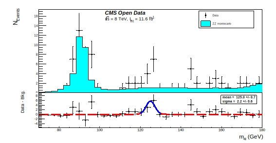

# Exam assignment
[](https://higgs-to4l-analysis.readthedocs.io/en/latest/?badge=latest)


This is the project for the exam of computing methods for experimental physics. The scope of this work is to find the Higgs boson in the decay channel H->ZZ->4l with CMS Open data.

This analysis is based on this [article](https://arxiv.org/abs/1202.1997).

## Requirements

Python3 and [PyRoot](https://root.cern/manual/python/)

## Usage

```bash
python3 -i -m higgs_to4l_analysis [-h] [-nofast] [-local] [-time]
```

| option | description |
|----|---|
| -h, --help | show this help message and exit                                                                                   |
| -nofast    | No-fast mode take data from raw file and it does the data  selection. This saves also data selected to data path. |
| -local     | Local mode take data from raw file in local and it does the data selection.                                       |
| -time      | Print the execution time.                                                                                         |

## Object and Event selection
The events are selected by applying the following cuts:
 - four lepton for event, in particular total charge and lepton number of 4l is neutral (4&mu;,4e,2&mu;2e);  
 - Transverse momentum;
    - muon > 5 GeV;
    - electron > 7 GeV;
 - Pseudorapidity:
    - muon < 2.4;
    - electron < 2.5;
 - Relative isolation < 0.4;
 - 3D impact parameter significance < 4;  
 - Longitudinal impact parameter w.r.t. primary vertex < 0.5 cm;
 - Transverse impact parameter w.r.t. primary vertex < 1 cm;
 - Mass of the lepton pair that closest to Z mass 40 < m < 120 GeV;
 - Mass of the other lepton pair 12 < m < 120 GeV;

## Histogram and Fit
The histogram is built by calculating the invariant mass of the selected events for both the data and the montecarlo.
From the difference of the histograms it is obtained the subplot to calculate the Higgs mass. The mass is calculated
using a simple Gaussian fit made with the RooFit library.




